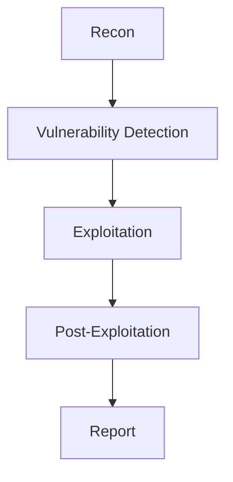

# /report Command

## Usage
```
/report <target>
/report <target> --format <md|html|pdf>
/report <target> --severity <critical|high|medium|low>
/report <target> --output <path>
```

## Description
Generates a comprehensive penetration testing report.

## Report Sections

### 1. Executive Summary
```markdown
# Executive Summary

## Overview
- **Target:** <target>
- **Scope:** <scope>
- **Date:** <date>
- **Analyst:** <analyst>
- **Duration:** <duration>

## Key Findings
- **Critical:** <count>
- **High:** <count>
- **Medium:** <count>
- **Low:** <count>

## Risk Rating
<overall_risk_rating>

## Summary
<executive_summary>
```

### 2. Attack Chain
```markdown
# Attack Chain

## Mermaid Diagram


## Attack Flow
1. **Reconnaissance**
   - Technology detection
   - Port scanning
   - Directory enumeration

2. **Vulnerability Detection**
   - PHPUnit CVE-2017-9841
   - SQL Injection
   - LFI

3. **Exploitation**
   - PHPUnit RCE
   - Database access
   - Flag capture

4. **Post-Exploitation**
   - System enumeration
   - Credential harvesting
   - Persistence
```

### 3. Findings Detail
```markdown
# Findings

## Finding 1: PHPUnit Remote Code Execution (CVE-2017-9841)

### Description
PHPUnit contains a vulnerability that allows remote code execution through the eval-stdin.php file.

### Severity
**Critical** (CVSS 3.1: 9.8)

### Affected Component
- **URL:** /vendor/phpunit/phpunit/src/Util/PHP/eval-stdin.php
- **Technology:** PHP, PHPUnit

### Proof of Concept
```bash
curl -sk -X POST "http://target.com/vendor/phpunit/phpunit/src/Util/PHP/eval-stdin.php" -d '<?php system("id");?>'
```

### Evidence
```
uid=33(www-data) gid=33(www-data) groups=33(www-data)
```

### Impact
- Remote code execution
- Full server compromise
- Data breach
- Lateral movement

### Remediation
1. Remove PHPUnit from production
2. Update to latest version
3. Block access to vendor directory
4. Implement WAF rules
```

### 4. System Information
```markdown
# System Information

## Target Details
- **IP Address:** <ip>
- **Hostname:** <hostname>
- **OS:** <os>
- **Web Server:** <webserver>
- **PHP Version:** <php_version>
- **Database:** <database>

## Open Ports
| Port | Service | Version |
|------|---------|---------|
| 80 | HTTP | Apache/2.4.49 |
| 443 | HTTPS | Apache/2.4.49 |
| 22 | SSH | OpenSSH 8.2 |

## Technologies
- Apache/2.4.49
- PHP/7.4
- MySQL 8.0
- PHPUnit 8.5
```

### 5. Timeline
```markdown
# Timeline

| Date | Time | Event |
|------|------|-------|
| 2026-08-03 | 10:00 | Reconnaissance started |
| 2026-08-03 | 10:15 | PHPUnit vulnerability detected |
| 2026-08-03 | 10:20 | RCE confirmed |
| 2026-08-03 | 10:25 | Database credentials extracted |
| 2026-08-03 | 10:30 | Flag captured |
| 2026-08-03 | 10:35 | Report generated |
```

### 6. Recommendations
```markdown
# Recommendations

## Critical Priority
1. **Remove PHPUnit from production**
   - Remove vendor/phpunit directory
   - Update deployment process

2. **Update Apache**
   - Upgrade to Apache 2.4.51+
   - Patch CVE-2021-41773

## High Priority
1. **Implement WAF**
   - Deploy ModSecurity
   - Configure OWASP CRS

2. **Disable directory listing**
   - Configure Apache: Options -Indexes
   - Add .htaccess rules

## Medium Priority
1. **Security headers**
   - Add X-Frame-Options
   - Add X-Content-Type-Options
   - Add Content-Security-Policy

2. **Input validation**
   - Implement parameterized queries
   - Add input sanitization

## Low Priority
1. **Error handling**
   - Disable debug mode
   - Custom error pages

2. **Logging**
   - Enable access logging
   - Configure error logging
```

## CVSS 3.1 Scoring

### Score Calculator
```
Attack Vector (AV): N/A/L/P
Attack Complexity (AC): L/H
Privileges Required (PR): N/L/H
User Interaction (UI): N/R
Scope (S): U/C
Confidentiality (C): N/L/H
Integrity (I): N/L/H
Availability (A): N/L/H
```

### Severity Ratings
| Score | Rating |
|-------|--------|
| 9.0-10.0 | Critical |
| 7.0-8.9 | High |
| 4.0-6.9 | Medium |
| 0.1-3.9 | Low |
| 0.0 | None |

## Output Formats

### Markdown
```bash
/report <target> --format md --output report.md
```

### HTML
```bash
/report <target> --format html --output report.html
```

### PDF
```bash
/report <target> --format pdf --output report.pdf
```

## Report Template

```markdown
# Penetration Testing Report

## <target>

**Date:** <date>
**Analyst:** <analyst>
**Version:** 1.0

---

## Table of Contents
1. [Executive Summary](#executive-summary)
2. [Attack Chain](#attack-chain)
3. [Findings](#findings)
4. [System Information](#system-information)
5. [Timeline](#timeline)
6. [Recommendations](#recommendations)

---

## Executive Summary
<executive_summary>

## Attack Chain
<attack_chain>

## Findings
<findings>

## System Information
<system_info>

## Timeline
<timeline>

## Recommendations
<recommendations>

---

**End of Report**
```

## Examples

### Generate Full Report
```
/report http://target.com
```

### Generate Report in HTML
```
/report http://target.com --format html
```

### Generate Report for Critical Findings Only
```
/report http://target.com --severity critical
```

### Generate Report to Specific Path
```
/report http://target.com --output /home/user/reports/target-report.md
```

## Output Format

### Report Generated
```
[REPORT] Generated for <target>
Format: <format>
Output: <path>
Findings: <count>
Critical: <count>
High: <count>
Medium: <count>
Low: <count>
```
